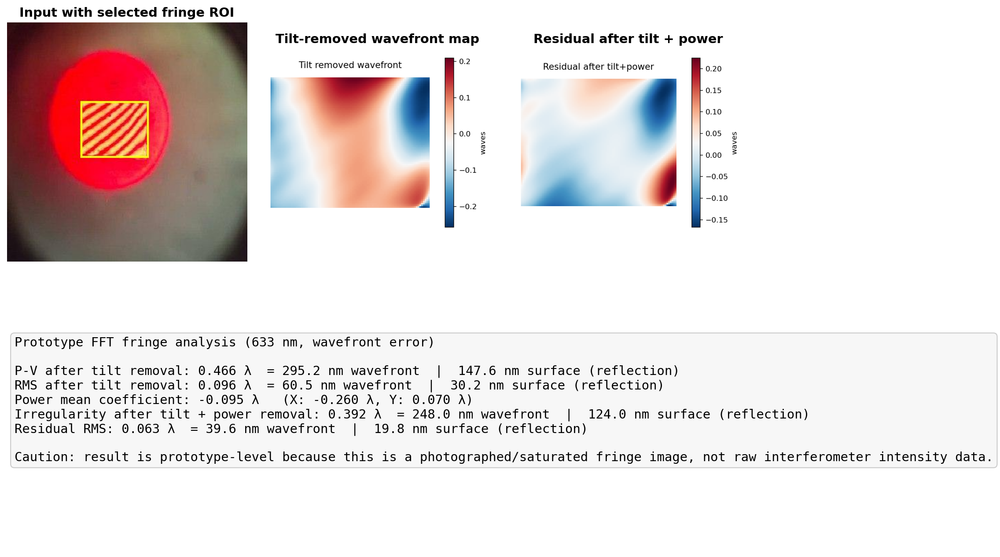

# 干涉条纹平面度分析器

这是一个 Python / FastAPI 项目，用于从干涉条纹图中估算平面度相关参数，重点面向**矩形孔径光学面**，例如六面平面转镜（hexagon scanning mirror）的单个反射面。

> 当前状态：工程原型。适合研发、验证、流程搭建；如果要作为正式计量工具，需要用原始干涉仪数据和可靠标准样品继续标定。

## 功能概览

### 1. Raw / Direct Fringe Mode

用于直接输入干涉条纹强度图。

功能包括：

- FFT carrier demodulation
- phase unwrapping
- 矩形孔径低阶面形拟合
- P-V、RMS、Power、Irregularity 估算
- 自动生成诊断报告图

### 2. Zygo Screenshot Audit Mode

用于已有 Zygo 截图的审查和归档。

功能包括：

- 裁剪 Zygo 截图中的 wavefront map
- 裁剪 colorbar
- 根据颜色条反推近似 wavefront map
- 用截图中的 P-V 作为校准值，估算显示图对应的 RMS 等参数

注意：这个模式不是独立计量，因为 P-V 是输入校准值。

## 诊断图示例

Raw fringe 模式会生成包含 ROI、wavefront map、residual map 和指标的诊断图：



## 快速启动：Python 源码模式

```bash
python3 -m venv .venv
. .venv/bin/activate
pip install -e .
uvicorn iflat.api:app --host 127.0.0.1 --port 8000
```

打开浏览器：

```text
http://127.0.0.1:8000/docs
```

健康检查：

```bash
curl http://127.0.0.1:8000/health
```

## CLI 示例

### Raw / Direct Fringe Mode

```bash
iflat raw-fringe path/to/fringe.jpg \
  --bbox 108,116,208,199 \
  --wavelength-nm 633 \
  --out reports/example_raw
```

### Zygo Screenshot Audit Mode

```bash
iflat zygo-screenshot path/to/Zygo0.png \
  --map-bbox 122,136,748,710 \
  --colorbar-bbox 900,66,927,804 \
  --pv-waves 0.200 \
  --wavelength-nm 633 \
  --out reports/example_zygo
```

## API 接口

### `POST /analyze/raw-fringe`

用于直接条纹图分析。

字段：

- `file`：条纹图片
- `bbox`：可选，格式 `x1,y1,x2,y2`，建议对拍摄图片提供
- `wavelength_nm`：默认 `633.0`
- `values_are`：默认 `wavefront_error`

### `POST /audit/zygo-screenshot`

用于 Zygo 截图审查。

字段：

- `file`：Zygo 截图
- `map_bbox`：wavefront map 的位置，格式 `x1,y1,x2,y2`
- `colorbar_bbox`：colorbar 的位置，格式 `x1,y1,x2,y2`
- `calibration_pv_waves`：Zygo 截图上显示的 P-V，单位 waves
- `wavelength_nm`：默认 `633.0`

## Linux 从 GitHub 安装源码版

```bash
git clone https://github.com/YonggangG/interferogram.git
cd interferogram
python3 -m venv .venv
. .venv/bin/activate
pip install --upgrade pip
pip install -e .
uvicorn iflat.api:app --host 0.0.0.0 --port 8000
```

打开：

```text
http://SERVER_IP:8000/docs
```

## Linux 从 GitHub / GHCR 安装 Docker 版

GitHub Actions 会发布镜像到 GHCR：

```text
ghcr.io/yonggangg/interferogram:latest
ghcr.io/yonggangg/interferogram:0.1.0
```

运行：

```bash
docker pull ghcr.io/yonggangg/interferogram:latest
docker run -d \
  --name interferogram \
  --restart unless-stopped \
  -p 8000:8000 \
  -e IFLAT_RUN_ROOT=/data/reports \
  -v iflat_reports:/data/reports \
  -v iflat_uploads:/data/uploads \
  ghcr.io/yonggangg/interferogram:latest
```

如果镜像暂时还没生成，可以从 GitHub 源码构建：

```bash
git clone https://github.com/YonggangG/interferogram.git
cd interferogram
docker build --network=host -t interferogram-flatness:0.1.0 .
docker run --rm -p 8000:8000 interferogram-flatness:0.1.0
```

## Portainer Stack YAML

在 Portainer → Stacks → Add stack → Web editor，粘贴：

```yaml
services:
  interferogram:
    image: ghcr.io/yonggangg/interferogram:latest
    container_name: interferogram
    restart: unless-stopped
    ports:
      - "8000:8000"
    environment:
      IFLAT_RUN_ROOT: /data/reports
    volumes:
      - iflat_reports:/data/reports
      - iflat_uploads:/data/uploads
    healthcheck:
      test: ["CMD", "python", "-c", "import urllib.request; urllib.request.urlopen('http://127.0.0.1:8000/health', timeout=3).read()"]
      interval: 30s
      timeout: 5s
      retries: 3
      start_period: 20s

volumes:
  iflat_reports:
  iflat_uploads:
```

也可以在 Portainer 里直接从 GitHub repo 部署：

- Repository URL: `https://github.com/YonggangG/interferogram.git`
- Branch: `main`
- Compose path: `docker-compose.yml`

更详细说明见：

[`docs/docker_portainer_deployment.md`](docs/docker_portainer_deployment.md)

## Windows 运行

Windows 下可以用 Python 源码模式或 Docker Desktop 模式运行。

说明见：

[`docs/windows_run_guide.md`](docs/windows_run_guide.md)

## 重要限制

- 如果输入不是原始干涉仪强度图，而是手机拍摄图或截图，结果只能作为趋势判断。
- 拍摄图会受透视、过曝、gamma、压缩和背景光影响。
- Zygo screenshot audit mode 依赖截图显示颜色和 P-V 校准，不是独立计量。
- Zernike-equivalent 输出还没有正式进入 public API。

## License

License 还未最终确定。正式对外复用前建议补充 License 文件。
